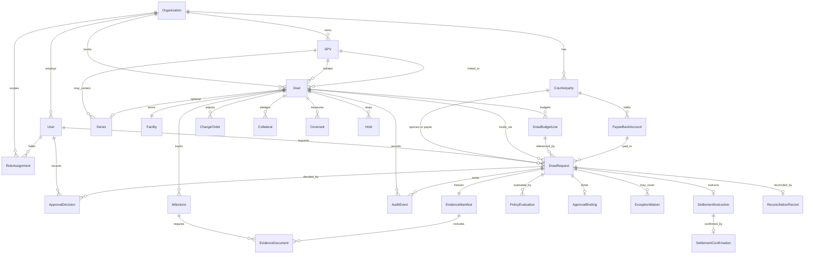

# DIBS Domain, State, and Event Model

| Field | Value |
|---|---|
| Version | 2026.09.19 |
| Status | Canonical Track A model. Supersedes `backend/workflow/capital-request.ts` state names and the mixed Priority Build Order. |
| Companion | `docs/architecture/DIBS-Complete-Scaffold.md` |
| Money | Integer minor units + ISO-4217 currency. No floats. |
| Tenant | From authenticated session. Never from a client-supplied header. |

This file is the single source of truth for:

1. The domain model
2. The capital-request state machine
3. The audit event model
4. What is MVP versus parked

`CapitalRequest` in current TypeScript is the prototype name. The canonical aggregate is **`DrawRequest`**. Rename the code to match this file. Do not keep two machines.

***

## 0. MVP versus parked

The previous Priority Build Order mixed a controlled-draw product with a future platform. That list is retired.

### Track A — build

```text
Sprint 0  Foundation: domain freeze, tenant, roles, audit contract, policy schema, threat model
Sprint 1  Core: auth, tenant isolation, RBAC, Deal, SPV, Counterparty, Payee, AuditEvent
Sprint 2  Draws: DrawRequest machine, budget lines, evidence manifest, policy evaluation, approval binding
Sprint 3  Controls: covenants, holds, exceptions, waivers, notifications
Sprint 4  Settlement records: instruction, confirmation (CSV first), reconciliation breaks
Sprint 5  Harden: SoD tests, webhook replay later, audit-chain verify, pilot runbooks
Sprint 6  Pilot: 1–3 live deals, manual/CSV confirmation, daily recon
```

### Parked — do not put on the domain diagram or in Sprints 0–4

| Item | Why it is parked |
|---|---|
| VRDCT / trust intelligence | Decision support. Not release authority. Phase 2 adapter. |
| Reporting platform beyond exception queues and audit export | Pilot can live on SQL + CSV. |
| ERC-4626 vault prototype | Different product story. Violates “DIBS is not tokenization.” |
| Reserve and tranche engine (Sentinel / Catalyst) | Vault-layer. Not Autopilot. |
| External yield routing | Settlement-adjacent speculation. No fund movement in DIBS. |
| Policy-loan subsystem | Separate product line. |
| Advanced analytics | After a working draw cycle. |
| Tokenization | Explicit non-goal. |
| API marketplace | No product to sell through a marketplace yet. |
| Quantum Optimization Lab | Track C. Offline, nonbinding. |
| PQC implementation | Track B hardening. Non-blocking. Do not stall Autopilot on ML-KEM. |

Pilot success is: a lender can run a draw from request to reconciled settlement record without a spreadsheet, and every hold reason is readable in under a minute.

***

## 1. Domain model

### 1.1 Bounded context

One control plane. One tenant scope. No rail owns its own approval, audit, or settlement logic.

```text
Organization (Tenant)
├── Users and RoleAssignments
├── Counterparties
│   └── PayeeBankAccounts
├── SPVs
│   └── optional Series
├── Deals
│   ├── Facility
│   ├── DrawBudgetLines
│   ├── Milestones
│   ├── Collateral
│   ├── Covenants
│   ├── Holds
│   ├── DrawRequests
│   │   ├── EvidenceManifest + EvidenceDocuments
│   │   ├── PolicyEvaluation
│   │   ├── ApprovalDecisions + ApprovalBinding
│   │   ├── ExceptionWaivers
│   │   ├── SettlementInstruction
│   │   ├── SettlementConfirmation
│   │   └── ReconciliationRecord
│   └── AuditEvents
└── IntegrationConnections
    └── WebhookEvents / CsvImportBatches
```

Cardinality: MVP default is one Deal per SPV. The model still allows `Organization → SPV → optional Series → Deal`. Do not hard-code 1:1.

### 1.2 Entity catalog (MVP only)

| Entity | Purpose | Notes |
|---|---|---|
| `Organization` | Tenant | Source of `tenant_id` |
| `User` | Human or service identity | Service accounts cannot approve |
| `RoleAssignment` | Role on tenant / deal / SPV | Conflict check reads this at decision time |
| `Counterparty` | Sponsor, lender, inspector, contractor, servicer | KYC/AML/sanctions live here |
| `PayeeBankAccount` | Settlement destination | Verification status + cooling period |
| `Deal` | Credit / project container | Pins `effective_policy_version` |
| `SPV` | Legal / accounting / collateral boundary | Lifecycle in later SPV Factory section |
| `Series` | Optional isolation inside an SPV | Nullable on MVP deals |
| `Facility` | Loan or line terms | Amount, maturity, retainage policy |
| `DrawBudgetLine` | Cost category + remaining | Change orders adjust this |
| `ChangeOrder` | Budget mutation | Approval-tiered. Never a silent realloc. |
| `Milestone` | Work / evidence gate | Escrow Factory may own wording |
| `Collateral` | Asset pledged | Valuation freshness is a covenant input |
| `Covenant` | Measurable control | Own satellite machine. Not a second capital machine. |
| `DrawRequest` | The capital request | Canonical aggregate |
| `EvidenceDocument` | One hashed file | Supersede only. Never delete. |
| `EvidenceManifest` | Frozen set bound to a draw | Hash locked at `SUBMITTED` |
| `PolicyVersion` | Immutable rule pack | New submissions use current. In-flight uses lock. |
| `PolicyEvaluation` | Structured PASS / HOLD / FAIL / REVIEW_REQUIRED | Bound to manifest + locked policy |
| `ApprovalDecision` | One actor’s yes / no | Distinct from requester and instructor |
| `ApprovalBinding` | Hash of amount, payee, manifest, policy, budget snapshot | Break → `UNDER_REVIEW` |
| `Hold` | Scoped stop | Draw / deal / SPV / counterparty / tenant |
| `ExceptionWaiver` | Time-limited cover of a failed rule | Does not overwrite the failure |
| `SettlementInstruction` | What DIBS asked the partner to pay | Not a fund movement |
| `SettlementConfirmation` | What the partner says happened | Signed webhook or dual-entry CSV |
| `ReconciliationRecord` | Match or break | No auto-reconcile of mismatches |
| `Task` | Approval / evidence / recon work item | SuperAgent may create. Cannot decide. |
| `AuditEvent` | Append-only fact | See §3 |
| `DealPassport` | Tenant-scoped operational history | Not a score. Not a release authority. |

Not entities in this model: `Vault`, `Tranche`, `VRDCTScore`, `PolicyLoan`, `Token`, `MarketplaceListing`, `QaoaExperiment`.

### 1.3 Relationship diagram



### 1.4 Critical `DrawRequest` fields

```text
id
tenant_id
deal_id
spv_id
series_id                  nullable
request_number
status
requested_by_user_id
payee_counterparty_id
payee_bank_account_id
amount_requested_minor
amount_approved_minor      set at APPROVED; ≤ requested
currency
budget_line_ids[]
requested_at
submitted_at
locked_policy_version      set at SUBMITTED
locked_evidence_manifest_hash
approval_binding_hash      set at APPROVED
policy_evaluation_id
evidence_status
approval_status
settlement_status
reconciliation_status
idempotency_key
created_at
updated_at
```

Prototype `requestedAmount: number` is rejected. Store minor units.

***

## 2. Capital-request state machine

One machine. Aggregate: `DrawRequest`.

Prototype states in `backend/workflow/capital-request.ts` (`pending`, `evidence_submission`, `validation`, `approval`, `approved_for_release`, `settled`, `settlement_exception`) are **retired**. Map them once, then delete the old enum.

### 2.1 State map from prototype → canonical

| Prototype | Canonical |
|---|---|
| `pending`
